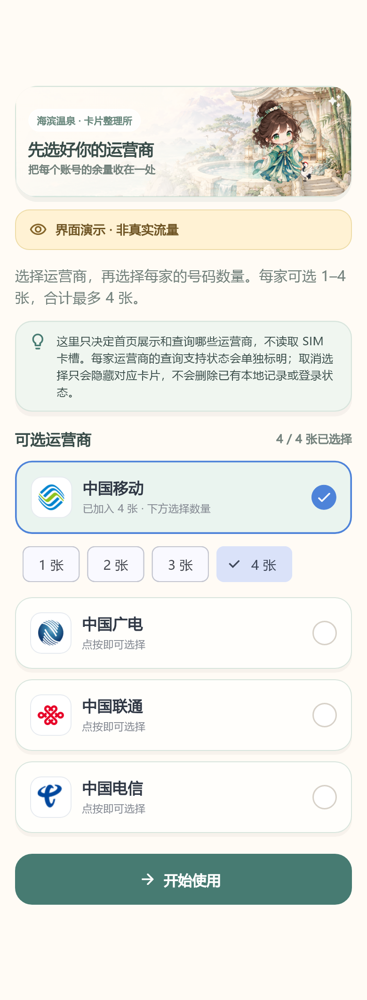
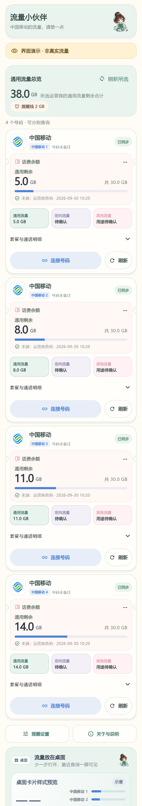
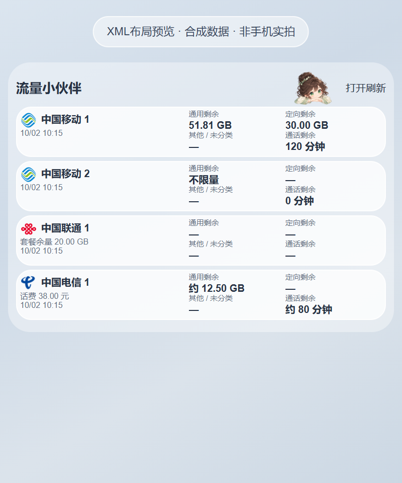
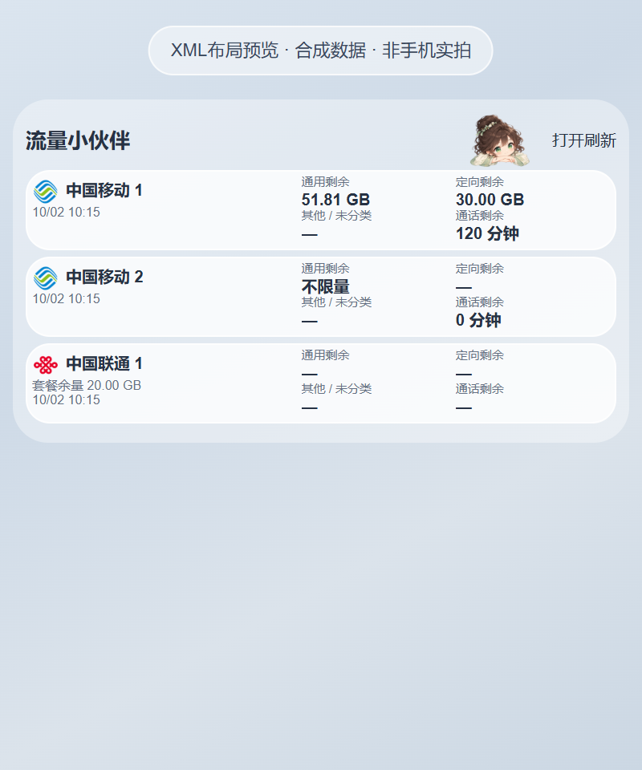

# 1.10.0 三四张卡与查询兼容

首次选择和设置现在直接选择每家一至四个号码，合计最多四张。同家号码分别使用独立网页登录资料，系统内核不支持隔离时会阻止新增，避免同一份数据显示多次。减少数量只收起卡片，保留备注、号码、历史查询和登录；重新加回沿用原身份。

安卓首页支持三四账号滚动查看，桌面三四卡使用紧凑布局，默认280dp高度可显示四张。组件过矮时提示另有几张，拉高或打开应用可查看。原版运营商Logo、玻璃底色、背景随实际卡片结束的布局保持；紧凑行优先显示异常与唯一套餐合计，再选话费或脱敏号码，详细信息在应用中查看。

官方网页明确显示“查询流量”文字按钮。联通官网随机密码登录仍由用户完成，桌面网页登录表单可缩放；应用不自动发送验证码或替用户勾选协议。联通官网旧会话检查改为异步、12秒限时，仍只允许已确认登录后的官网原查询。

电信修复页面持续变化导致数据扫描被无限推迟，以及过早回传被忽略后不再发送的问题。查询重新加载官方页并显式扫描当前页面；超时结束加载并保留上次已确认数据。官网显示值估算仍标“约”，不把估算额当已确认通用余量。

移动仅返回通话或短信时，明确提示尚未取得流量。移动独立话费来源仍未接入，不能将实时费用字段猜成余额。本轮没有三家真实账号的新增成功验收，不能据合成测试保证所有省份和套餐可查询。核查详情见[运营商查询兼容复核](CARRIER_COMPATIBILITY_1.10.md)。

iOS 源码同步扩展稳定第三/第四账号及隔离仓库；小/中/大号 Widget 原有1/2/4张的尺寸规则保持。没有 iPhone 签名安装包，本轮 macOS编译状态需单独核对。

正式安卓下载仅提供一个 Release ARM64 APK，适用 Android 7.0及以上，版本1.10.0/code17。保留1.8.1已在荣耀验证的Room启动keep修复。新版本未连接USB做设备验收，Launcher缩放、大字号和各号码登录仍待实机反馈。

[下载安装](https://github.com/huachen19867/liuliang-buddy/releases/download/v1.10.0/liuliang-buddy-release.apk) · [源码](https://github.com/huachen19867/liuliang-buddy/tree/v1.10.0)

以上均使用合成数据。应用截图来自实际Flutter组件；桌面预览读取实际RemoteViews XML，非手机实拍。

## 验证

完整 Flutter 166 项通过，analyze 无问题；Android JUnit 29 项通过；联通 10 组 Node 与电信 13 组本地 Chrome 合成回归通过，fetch/XHR来源与保真回归通过。新增数量选择截图单项重渲染通过。三四卡XML预览校验53个ID、280dp四卡和背景边界；官网真实账号与Launcher新版本尚未验收。

正式APK 27,447,596 字节（27.45 MB），SHA-256：

`46a37628054f377a3e640a3a1b5dc78c715dce249fa9161f3d2750a7c0663606`

版本1.10.0/code17、API24/36、仅ARM64、非debuggable；apksigner v2通过，正式签名证书SHA-256 `33b115558027fdfa667a3f14a9351fbdb29901948c085daf739e16a9055a497e` 与此前正式版一致，16KB ZIP对齐通过。正常 flutter build apk --release构建，未使用DEMO或调试签名，构建脚本已恢复Gradle wrapper。

公开仓库只上传这个APK；截图放源码和发布正文。iOS最新源码的macOS云端验证由GitHub Actions独立执行，未在Windows冒称已编译。
