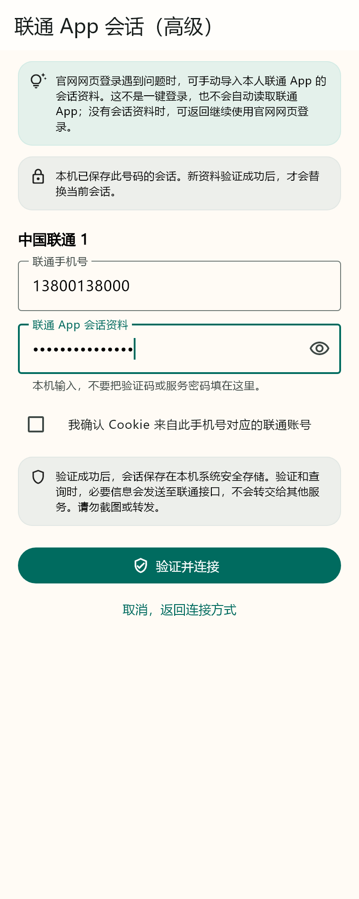
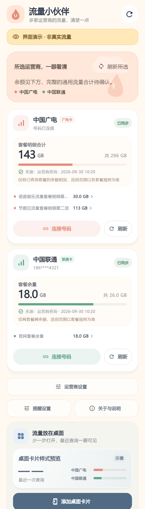

# 1.10.1 联通 App 查询与查询稳定性

本版参考已经下载的联通开源方案独立实现可选的 App 查询通道，并复核四家查询、前后台时效、多卡和缓存恢复。默认网页登录继续保留；在联通卡的连接方式或设置中可选“联通 App 查询（试验）”。该入口需要用户手动导入自己的 Cookie 或 JSON token 会话，不提供一键验证码登录，也不会自动读取其他 App。

联通套餐与话费分别请求；话费失败保留取得的流量，缺失不显示零。明确认证失效才最多续期一次，服务器须返回完整匹配号码和新的 Cookie，拒绝脱敏或不匹配号码自动绑定。Cookie 导入的号码归属需用户确认，查询成功码本身不能证明号码。每卡独立安全存储，隐藏卡保留会话，切换官网或清除连接会删除相应会话。

App 会话打开应用即刷新，首页、原有 Android 后台周期和桌面卡片同步使用查询结果。认证失效后自动刷新暂停，等待重新连接，手动刷新仍可重试；切换模式、编辑号码或清除时停止后续请求并拒绝旧结果落盘。原有每小时、每两小时、每天及关闭的设置保持。后台单卡安全存储读取失败不会直接中断其他卡，网页回调复用前台的合法页面判断，WebView 清理有短期限。

首页“其他流量”改为“用途未知”，不把未知套餐误称可通用。缓存中的负数、合计溢出、有限套餐剩余大于总量、不限量与数字冲突谨慎恢复为未知，保留异常行避免生成部分合计。移动仍缺已确认独立话费来源，电信仍为官网显示值估算且不尝试后台认证；本版没有臆造其余三家新接口。

老板暂时没有联通卡可供验证，本版没有真实账号或新设备验证。AppID、设备校验、不同省份/套餐、系统后台调度仍需反馈；不能把合成测试和签名构建宣传为联通已全面可用。接口和许可来源、验证范围见[联通接入记录](UNICOM_APP_QUERY_PROGRESS.md)。

[安卓下载安装](https://github.com/huachen19867/liuliang-buddy/releases/download/v1.10.1/liuliang-buddy-release.apk) · [对应源码](https://github.com/huachen19867/liuliang-buddy/tree/v1.10.1)

正式下载仅一个 Release ARM64 APK，Android 7.0及以上，1.10.1/code18；沿用正式证书和 Room 启动修复。没有 iPhone 签名安装包。最终检查与公开回执在本文件及 TECH_LOG 后续记录。

上述为实际 Flutter 组件渲染的合成预览，号码和余额为样本，不是实号或手机实拍。

## 验证与安装包

完整 Flutter 220 项全部通过，静态分析无问题。覆盖新增查询/续期、主流程双账号与旧响应门禁、异常缓存、会话页小屏/大字/键盘以及实际组件预览。项目 Android 原生 JUnit 29 项重跑通过（`:app:testDebugUnitTest --rerun`）；正式构建42.8秒完成。全模块原生测试在第三方 shared_preferences_android 的 SDK36 Robolectric 测试处因 Java17 不满足 Java21 要求失败，不计为全模块通过。没有新增 USB 或真实运营商账号验证。

APK 为 27,907,248 字节（27.91 MB）；SHA-256：

`30869ed0cfcf9ffeb40a1d8c6411acf2269f6807489ec58eedf8db8291905a56`

版本1.10.1/code18，API24/36，仅 ARM64、非 debuggable；apksigner v2 通过，正式证书 SHA-256 `33b115558027fdfa667a3f14a9351fbdb29901948c085daf739e16a9055a497e` 与此前相同，16KB ZIP 对齐通过。Gradle wrapper 已恢复，未打包本地参考项目或研究截图，未使用 DEMO。

已正式公开发布，Release 非草稿、非预发布，tag 指向 `a0ac8e839d3225edb36e25955b85780ce1a13866`。唯一 APK asset 为 uploaded，远端字节数和 SHA-256 与上述一致。iOS 当前版本云端验收尚待完成；源码主分支另同步修正三四卡选择页的旧测试文案，不移动安卓发布 tag。
