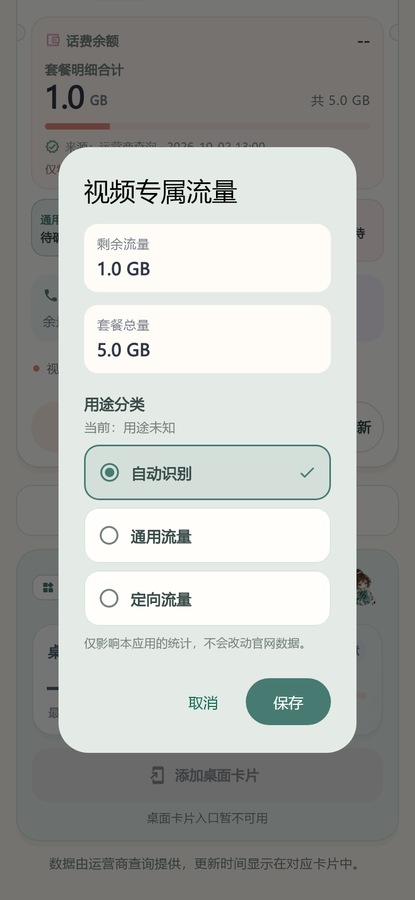

# 1.10.2 套餐分类与卡片同步

在 APP 首页展开“套餐与通话明细”，点击单个流量套餐，即可选择“自动识别”“通用流量”或“定向流量”，保存后首页、桌面卡片及已开启的通知栏余额同步采用分类。现在通用流量套餐也保留明细入口，分类之后仍可重新打开并恢复自动识别。

每个号码分别记住选择，刷新后按唯一的完整套餐名应用，金额变化和明细顺序变化不影响。自动识别结果另行保留，恢复自动不会重新登录，也不会改变余量、单位、不限量标记或上次查询时间。编辑备注保留选择，修改号码删除该账号的分类；隐藏卡片保留设置，清除连接与本地数据删除所有分类。

运营商总览、联通官网套餐合计以及同名或无名称的套餐不能手动分类，弹窗给出原因。手动选择不改变官网规则，未知单位或异常额度不会因选择“通用”而变成可确认数字，不限量保持不限量，低流量提醒包含手动分类时注明。联通 App 查询仍为手动会话导入的高级试验通道，真实账号和省份兼容性仍待验证。

本功能只在 APP 中设置，卡片同步不需要重新添加组件。后台查询不会写回分类配置，发布结果前重新读取当前选择。Android 系统调度、组件宿主及平台调用失败仍可能导致展示延迟，后续返回应用或刷新会再次同步。iOS 使用相同前台分类和 WidgetKit 展示快照，暂无可安装的 iPhone 签名包。

[正式安卓下载](https://github.com/huachen19867/liuliang-buddy/releases/download/v1.10.2/liuliang-buddy-release.apk) · [源码](https://github.com/huachen19867/liuliang-buddy/tree/v1.10.2)

完整 Flutter 244 项测试通过，静态分析无问题。新增回归覆盖账号隔离、乱序刷新、重复名称/汇总保护、未知单位、恢复自动、弹窗取消/失败重试/大字，以及保存后即时组件同步、重启保留、查询中修改分类、改备注和换号码拒绝旧弹窗。项目 Android 原生 JUnit 29 项重跑通过，未运行第三方依赖库全模块测试。本轮未连接 USB、真实运营商账号或新桌面宿主，不能以合成测试冒称真机验收。

正式签名 Release 构建91.0秒完成，版本1.10.2/code19，Android API24/36，仅ARM64、非debuggable，apksigner v2和16KB ZIP对齐通过，使用既有正式证书。唯一APK为27,907,308字节（27.91 MB），SHA-256 `6184e1a6efd977d32be82bfd7fad89186991014913d17b738e93934d78a030e0`。正式证书 SHA-256 `33b115558027fdfa667a3f14a9351fbdb29901948c085daf739e16a9055a497e`，未使用演示数据构建。公开发布回执见技术日志。

正式 Release 已公开，非草稿、非预发布，tag 指向 `8baf3191fb615116de742f4030d256b3be3ae9bd`；唯一 APK asset 为 uploaded，远端字节数与 digest 核对一致。[本版本 iOS 云端验证](https://github.com/huachen19867/liuliang-buddy/actions/runs/36969764815)交付回读进行中，暂无新版本通过回执。

实现与复用说明见 [数据契约](TRAFFIC_CLASSIFICATION_DATA.md)、[界面记录](TRAFFIC_CLASSIFICATION_UI.md)、[前后台审查](TRAFFIC_CLASSIFICATION_REVIEW.md)和 [技术日志](TECH_LOG.md)。

预览使用实际 Flutter 组件和合成套餐数据，不是真实运营商账号或真机实拍。
